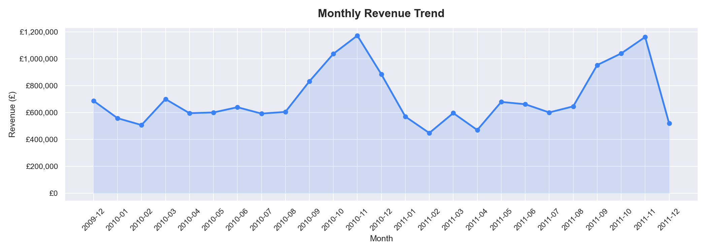
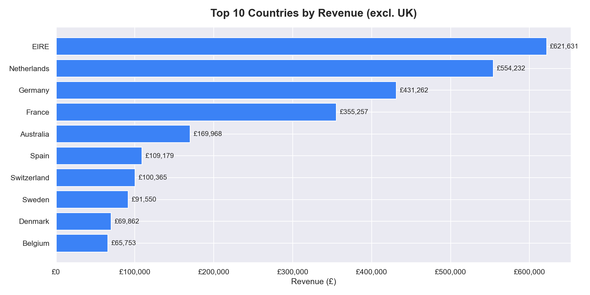
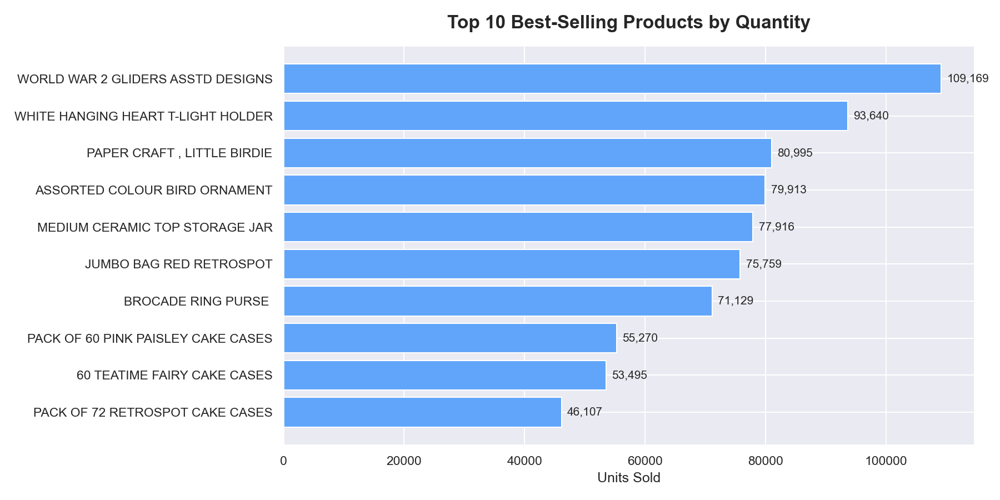
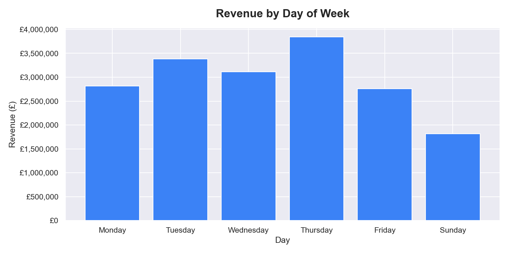
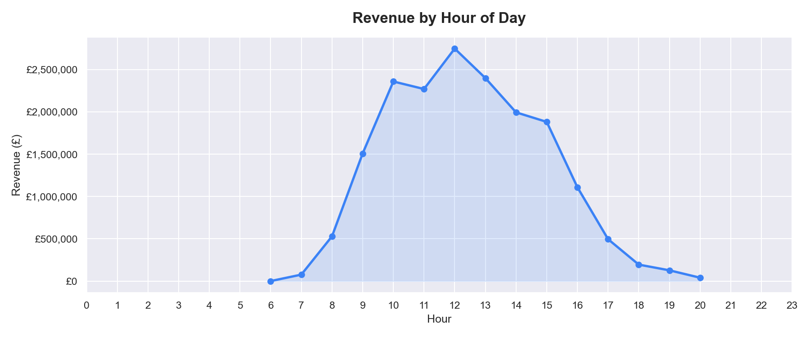
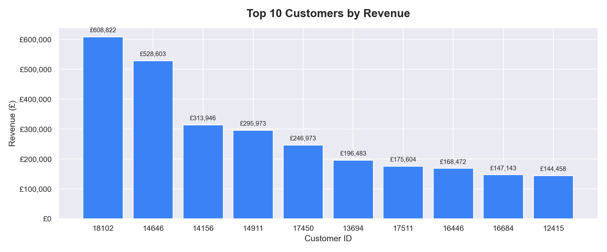

# 🛍️ RetailInsight — E-Commerce Sales Analysis

An exploratory data analysis of a UK-based online retail dataset covering 500K+ transactions. The goal is to uncover revenue trends, top-performing products, country-level performance, and customer behaviour patterns using Python.

---

## 📋 Table of Contents

- 🎯 Project Overview
- 📊 Key Questions Answered
- 📈 Visualizations
- 🛠️ Technologies Used
- 📁 Project Structure
- 🚀 How to Run
- 💡 Key Findings
- 👨‍💻 Author

---

## 🎯 Project Overview

This project analyses transactional data from a UK-based non-store online retailer. The dataset includes all transactions between **2010 and 2011** and contains information about invoices, products, quantities, prices, customers, and countries.

The analysis covers:
- Data cleaning and preprocessing
- Revenue and sales trend analysis
- Country and product performance
- Customer behaviour insights

---

## 📊 Key Questions Answered

- How does revenue trend month by month?
- Which countries generate the most revenue outside the UK?
- What are the best-selling products by quantity?
- Which days of the week and hours of the day drive the most sales?
- Who are the top customers by total spend?

---

## 📈 Visualizations

### Monthly Revenue Trend


### Top 10 Countries by Revenue


### Top 10 Best-Selling Products


### Revenue by Day of Week


### Revenue by Hour of Day


### Top 10 Customers by Revenue


---

## 🛠️ Technologies Used

- **Language:** Python 3.12
- **Data Manipulation:** Pandas, NumPy
- **Visualization:** Matplotlib, Seaborn
- **Environment:** Jupyter Notebook

---

## 📁 Project Structure

```
RetailInsight/
├── analysis.ipynb          ← Main analysis notebook
├── README.md
├── data/
│   └── online_retail_II.csv   ← Raw dataset (not tracked by git)
└── outputs/
    ├── monthly_revenue.png
    ├── top_countries.png
    ├── top_products.png
    ├── day_of_week.png
    ├── hourly_sales.png
    └── top_customers.png
```

---

## 🚀 How to Run

**1. Install dependencies:**
```bash
pip install -r requirements.txt
```

**2. Download the dataset:**

Get `online_retail_II.csv` from [Kaggle](https://www.kaggle.com/datasets/mashlyn/online-retail-ii-uci) and place it inside the `data/` folder.

**3. Run the notebook:**
```bash
jupyter notebook analysis.ipynb
```

Run all cells top to bottom. Charts will be saved automatically to `outputs/`.

---

## 💡 Key Findings

- Revenue peaked in **November 2011**, likely driven by pre-Christmas shopping
- **Netherlands, EIRE, and Germany** are the top international markets
- Most sales occur between **10:00 – 15:00**, with Thursday being the busiest day
- A small group of customers (~top 10) contributes disproportionately to total revenue

---

## 👨‍💻 Author

**Berke Arda Turk**  
Data Science & AI Enthusiast | Computer Science (B.ASc)  
[🌐 Portfolio](https://berkeardaturk.com) · [💼 LinkedIn](https://www.linkedin.com/in/berke-arda-turk/) · [🐙 GitHub](https://github.com/Mood07)
